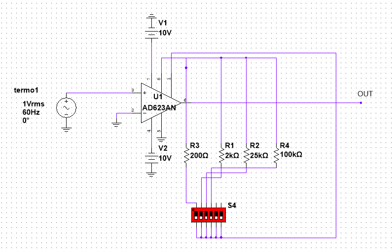
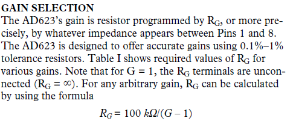

## Amplificador de instrumentacion AD623AN

Se va a utilizar como amplificador ajustable mediante resistencias el AD623AN, el cual puede ajustarse mediante resistencias en sus patillas 8 y 1 el cual se seleccionan mediante un DipSwitch como se muestra en la imagen 1  

Este OP va a funcionar para los 2 canales, por lo tanto, un circuito gemelo se va a utilizar con la otra termocupla.

Para obtener la ganancia deseada, el amplificador cuenta con una ecuacion que permite determinar la resistencia imagen 2  

La imagen 2 muestra los pasos para determinar la R necesaria para la ganancia, en nuestro caso vamos a utilizar
1. R= 200 Ohmns para una G=500
2. R= 2 KOhmns para una G= 50
3. R= 25 KOhmns para una G= 5
4. R= 100 KOhmns para una G= 2 

Ya con el Switch, seleccionamos cada juego de resistencias necesario, como lo muestra la figura 1.
