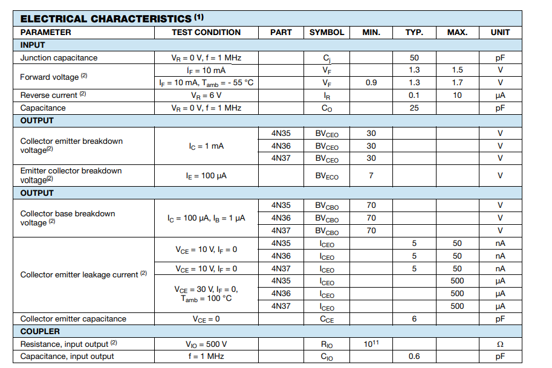
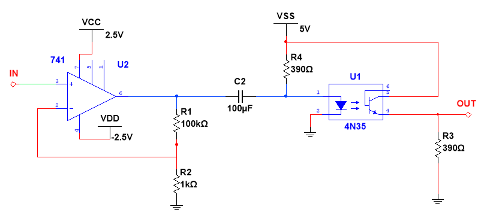

### Etapa de aislamiento:

1) Para esta parte se tienen dos subcircuitos, el primero de ellos es una fase preliminar de amplificacion de la señal de la termocupla, en donde se utiliza un OPAMP 741 como amplificador no inversor con una ganancia de 100 aproximadamente dada la siguiente ecuacion:

$$ Vout = Vin(1+(\frac{100k}{1k}) $$
$$ Vout = 101Vin $$

2) Para el siguiente subcircuito se utilizó un optoacoplador 4N35 para aislar la señal de los canales, configuró de forma que se trabajara Current Transfer Ratio (CTR) del 100% con el fin de tener una ganancia unitaria y con esto tenemos $I_c$ igual a $I_e$.

$$ CTR = 1 \\
 V_F = 1.3 V \\
 I_c = 10 mA $$

Con esto se puede encontrar el valor de la resistencia limitadora de corriente para el LED y se calculó con la siguiente ecuación:

$$ R = \frac{V_{cc}-V_F}{I_c} $$
$$ R = \frac{5-1.3}{0.01} $$
$$ R = 390 $$

