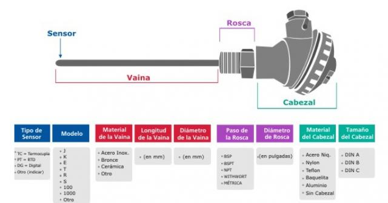
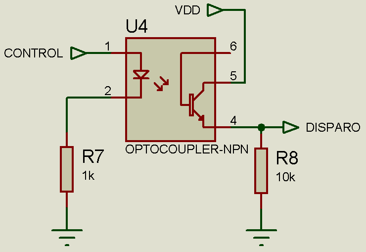

# Laboratorio II: Diseño de un sistema de adquisición de datos
## Taller de Instrumentación - Tecnológico de Costa Rica
### Sede Alajuela, Segundo Semestre 2023
### Profesor: Kaleb Alfaro Badilla

---

## Portada

- **Tecnológico de Costa Rica**
- *Escuela de Electrónica*
- *Curso: EL-5822 Taller de Instrumentación*
- *Sede: Alajuela*
- *Segundo Semestre, 2023*

---

### Realizado por:

- Alexander Castro 2017153854
- Andrés Carrillo 2017106733
- Douglas Kopper 2017220194
- Steven Arias 2017097670

---

# Parte I: Solución del Cuestionario Previo

## Pregunta 1:
¿Cuales son los tipos de sensores de temperatura más populares? ¿Cuáles son sus ventajas y desventajas en función de los requisitos del diseño?

###Respuesta:
Termistores:
Los termistores son sensores económicos y compactos que responden rápidamente a los cambios de temperatura. Son sensibles pero su precisión puede ser limitada en algunos rangos. Son ideales para aplicaciones que requieren respuestas rápidas a cambios de temperatura.

Termopares:
Los termopares son versátiles y duraderos, especialmente en entornos de alta temperatura. Sin embargo, su precisión es relativamente baja en comparación con otros sensores. No requieren una fuente de alimentación externa, lo que los hace adecuados para aplicaciones en las que se necesita medir temperaturas extremas.

RTD (Resistencia Térmica de Detracción):
Los RTD ofrecen alta precisión y estabilidad en un rango amplio de temperaturas. Son ideales cuando se requieren mediciones muy precisas. Sin embargo, pueden ser más costosos que otros sensores y tienen una respuesta más lenta a los cambios de temperatura.

Termómetros de infrarrojos (IR):
Los termómetros de infrarrojos miden la temperatura superficial sin contacto. Son rápidos y útiles para medir objetos a distancia. Sin embargo, pueden verse afectados por la emisividad de la superficie y otros factores, lo que podría afectar su precisión.

IC de sensor de temperatura:
Los sensores de temperatura integrados son pequeños y precisos. Algunos ofrecen interfaces digitales, lo que los hace fáciles de usar en sistemas electrónicos. Sin embargo, pueden ser más costosos y tener limitaciones en ciertos rangos de temperatura.

Sensores de temperatura basados en diodos:
Estos sensores utilizan diodos de silicio para medir la temperatura. Son precisos y convenientes para aplicaciones electrónicas. Sin embargo, su precisión puede ser menor que la de otros sensores más especializados.

## Pregunta 2:
¿Cuales son los tipos de termocuplas? ¿Cuales son sus rangos de temperatura y tensión?

###Respuesta:
Las termocuplas son sensores de temperatura que funcionan en base al principio de que cuando dos metales diferentes se unen en un extremo y se exponen a una diferencia de temperatura, se genera una diferencia de potencial (fuerza electromotriz) en el otro extremo de la termocupla. Existen varios tipos de termocuplas, designados por letras y combinaciones de metales que las componen.

**Algunos Tipos de Termocuplas Comunes**
1. - Tipo K (Cromel-Alumel):
   - Rango de Temperatura: Aproximadamente -270°C a 1372°C (-454°F a 2502°F).
   - Tensión Generada: Alrededor de 41 μV/°C.
2. - Tipo J (Hierro-Constantán):
   - Rango de Temperatura: Aproximadamente -210°C a 1200°C (-346°F a 2192°F).
   - Tensión Generada: Alrededor de 52 μV/°C.
3. - Tipo T (Cobre-Constantán):
   - Rango de Temperatura: Aproximadamente -270°C a 400°C (-454°F a 752°F).
   - Tensión Generada: Alrededor de 43 μV/°C.
4. - Tipo E (Cromel-Constantán):
   - Rango de Temperatura: Aproximadamente -270°C a 1000°C (-454°F a 1832°F).
   - Tensión Generada: Alrededor de 68 μV/°C.
5. - Tipo N (Nicrosil-Nisil):
   - Rango de Temperatura: Aproximadamente -270°C a 1300°C (-454°F a 2372°F).
   - Tensión Generada: Alrededor de 39 μV/°C.
6. - Tipo B (Platino-Rodio/Platino):
   - Rango de Temperatura: Aproximadamente 0°C a 1820°C (32°F a 3308°F).
   - Tensión Generada: Varía, alrededor de 10 μV/°C a 25 μV/°C.

**Notas sobre Rangos y Tensiones**
- Los rangos de temperatura y las tensiones generadas pueden variar ligeramente según las fuentes y las normas específicas utilizadas en la industria.
- Las termocuplas son adecuadas para diferentes aplicaciones en función de sus rangos de temperatura y sus propiedades específicas. La elección de la termocupla adecuada depende de los requisitos del diseño y el entorno de operación.
- Las tensiones generadas por las termocuplas son pequeñas y requieren amplificación para su lectura precisa.

## Pregunta 3:
¿Pregunta?

###Respuesta:
Respuesta.

## Pregunta 4:
¿Qué es el aislamiento eléctrico entre dos tierras? ¿En los diseños electrónicos que ventajas tiene el aislamiento entre señales?

###Respuesta:
El aislamiento eléctrico entre dos tierras se refiere a la práctica de separar dos partes de un sistema eléctrico o electrónico para evitar que las corrientes eléctricas fluyan entre ellas. Se logra utilizando materiales aislantes o dispositivos como transformadores o optoacopladores para evitar la conexión directa de las tierras.

**Ventajas del Aislamiento entre Señales en Diseños Electrónicos**
    1. **Prevención de Corrientes Parásitas:** El aislamiento evita la circulación de corrientes parásitas o fugas eléctricas entre diferentes partes del sistema. Esto es especialmente útil en circuitos sensibles o de alta impedancia.
    2. **Eliminación de Bucles de Tierra:** Los bucles de tierra pueden generar ruido y interferencias en los circuitos. El aislamiento entre señales evita la formación de bucles de tierra, mejorando la integridad de la señal.
    3. **Protección contra Descargas y Sobretensiones:** En sistemas donde puede haber diferencias de potencial significativas, el aislamiento protege contra descargas eléctricas y sobretensiones que podrían dañar componentes.
    4. **Mejora del Aislamiento Galvánico:** En sistemas que requieren aislamiento galvánico (aislamiento entre partes con diferentes potenciales), el aislamiento eléctrico asegura que no se establezcan conexiones conductivas no deseadas.
    5. **Reducción de Ruido y Interferencias:** El aislamiento minimiza la transferencia de ruido electromagnético entre circuitos, lo que mejora la calidad de las señales y la precisión de las mediciones.
    6. **Compatibilidad de Potencia:** Permite la interconexión de componentes o sistemas con diferentes niveles de potencia sin el riesgo de cortocircuitos.
    7. **Seguridad:** En sistemas donde hay interacción con usuarios, el aislamiento eléctrico puede mejorar la seguridad al evitar el riesgo de descargas eléctricas.

## Pregunta 5:
Investigue diseños electrónicos para aislar eléctricamente señales DC o de baja frecuencia (<100Hz).

###Respuesta:
 Optoacopladores (Optoaisladores):
Los optoacopladores son dispositivos que utilizan un LED en una parte del circuito y un fototransistor en la otra. La señal de entrada se convierte en una señal de luz por el LED, que luego se detecta en el fototransistor y se convierte de nuevo en una señal eléctrica. Esto proporciona aislamiento galvánico, ya que no hay conexión eléctrica directa entre las dos partes del circuito. Los optoacopladores son ideales para señales de baja frecuencia y DC, y son comunes en aplicaciones de control y monitoreo.

 Transformadores:
Los transformadores son otra opción para lograr el aislamiento eléctrico. Consisten en dos bobinas enrolladas alrededor de un núcleo de ferrita. La señal de entrada se induce en la primera bobina y se acopla magnéticamente a la segunda bobina, creando así una señal aislada eléctricamente en la salida. Los transformadores son efectivos para señales de baja frecuencia y pueden manejar niveles de potencia más altos que los optoacopladores.

## Pregunta 6:
¿Pregunta?

###Respuesta:
Respuesta.

## Pregunta 7:
¿Pregunta?

###Respuesta:
Respuesta.

---

# Bibliografía

1.
2.  National Institute of Standards and Technology (NIST). "Thermocouples Calibrations Services". [Enlace a la fuente](https://www.nist.gov/pml/sensor-science/thermodynamic-metrology/thermocouples-calibrations-services).
3. Ref3.
4. Texas Instruments. "Isolation: Understanding Signal and Power Isolation in Digital Systems". [Enlace de la fuente] (https://www.ti.com/lit/an/slla197/slla197.pdf)
5. Referencia5.
6. Referencia6.
7. Referencia7.

---
