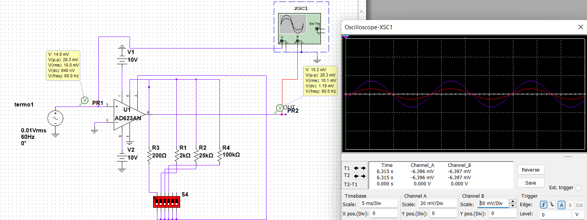

##Simulacion de Ganancia Ajustable

Ya con el circuito simulado se obtienen los siguientes comportamientos

La particularidad el OP es que con las patillas al aire, se obtiene una ganancia unitaria, tal como lo muestra la imagen de arriba, luego para una ganancia G=500 se obtiene la siguiente respuesta:

