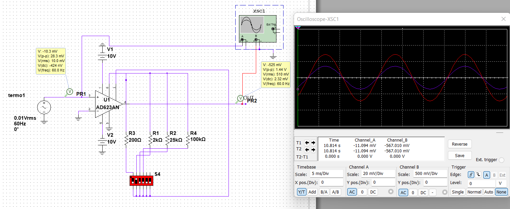
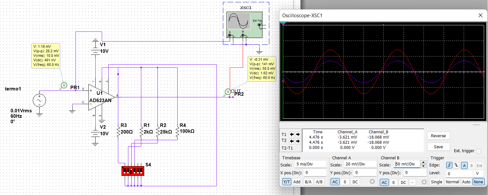
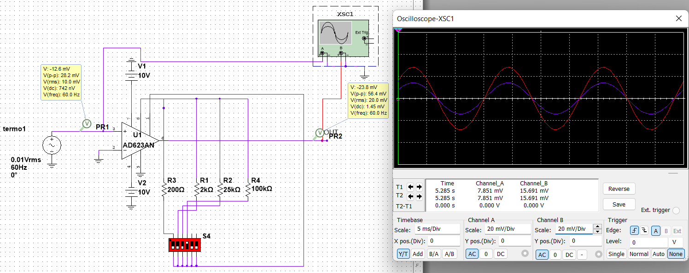

##Simulacion de Ganancia Ajustable

Ya con el circuito simulado se obtienen los siguientes comportamientos

La particularidad el OP es que con las patillas al aire, se obtiene una ganancia unitaria, tal como lo muestra la imagen de arriba, luego para una ganancia G=500 se obtiene la siguiente respuesta:

Analizando mejor la imagen, vemos que la tension de salida es 500 veces mas alta que la entrada, incluso el osciloscopio nos ilustra mejor la señal, lo mismo sucedera con las demas ganancias.

1.
   Ganancia de 50 
2.
   Ganancia de 5 
3.
    Ganancia de 2 
